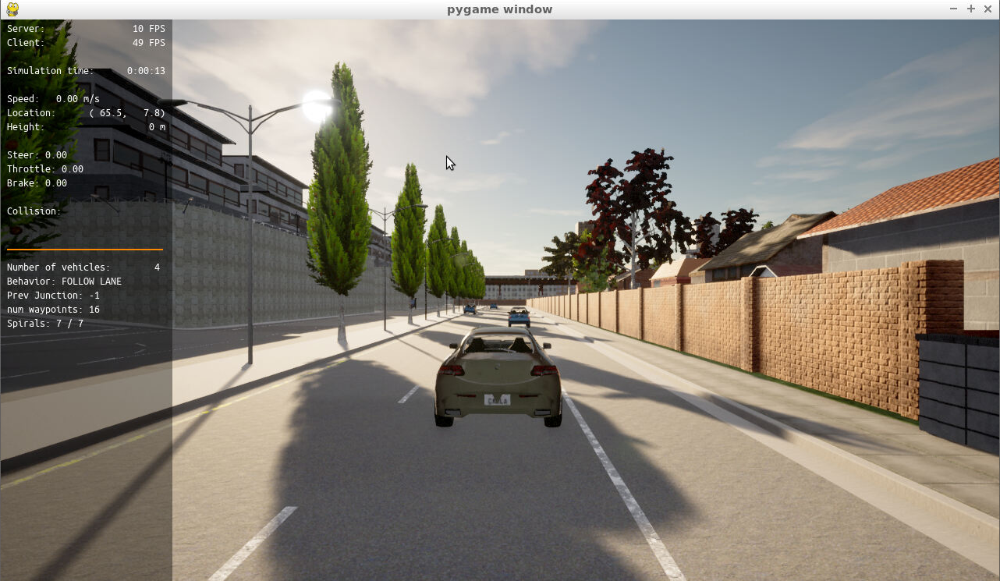
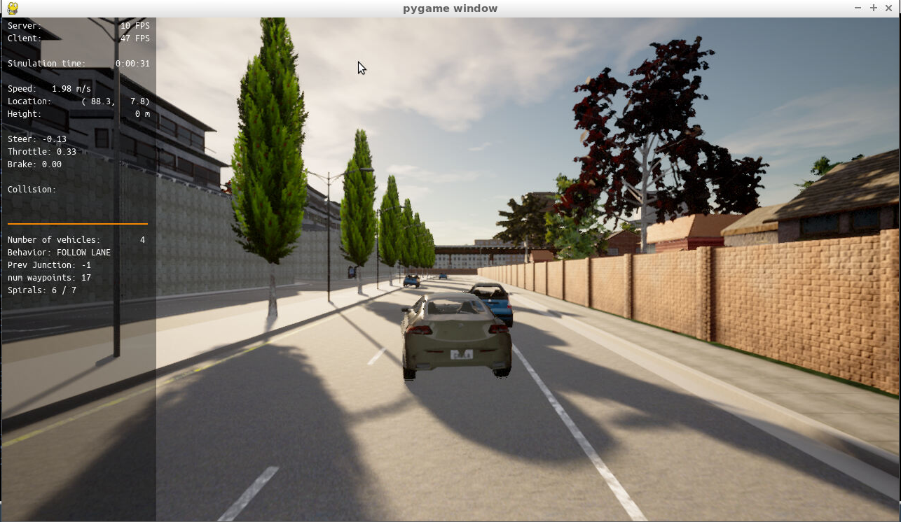
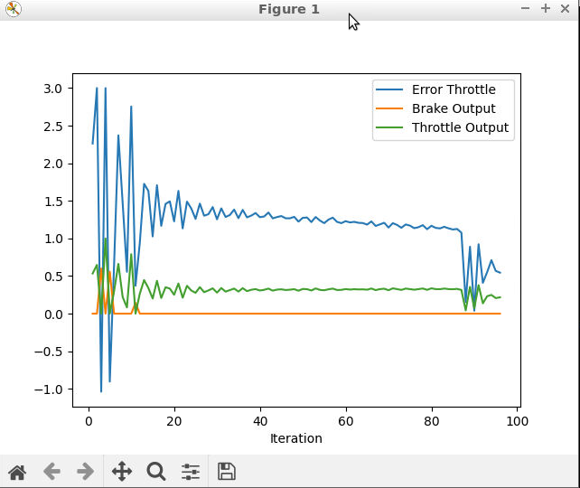
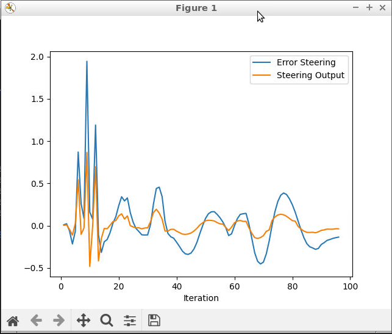

# Control and Trajectory Tracking for Autonomous Vehicle

# Proportional-Integral-Derivative (PID)

In this project, PID controller is designed to perform vehicle trajectory tracking. Given a trajectory as an array of locations, and a simulation environment, PID controller is designed and test its efficiency on the CARLA simulator used in the industry.

### Installation

Run the following commands to install the code:

Clone the <a href="https://github.com/atanasko/Control-an-Trajectory-Tracking-forAutonomous-Vehicles.git" target="_blank">repository</a>:

`git clone https://github.com/atanasko/Control-an-Trajectory-Tracking-forAutonomous-Vehicles.git`

## Run Carla Simulator

Open new window

* `su - student`
// Will say permission denied, ignore and continue
* `cd /opt/carla-simulator/`
* `SDL_VIDEODRIVER=offscreen ./CarlaUE4.sh -opengl`

## Compile and Run the Controller

Open new window

* `cd nd013-c6-control-starter/project`
* `./install-ubuntu.sh`
* `cd pid_controller/`
* `rm -rf rpclib`
* `git clone https://github.com/rpclib/rpclib.git`
* `mkdir build`
* `cd build`
* `cmake ../`
* `make` (This last command compiles your c++ code, run it after every change in your code)

## Testing

To test your installation run the following commands.

* `cd /home/workspace/project`
* `./run_main_pid.sh`
This will silently fail `ctrl + C` to stop
* `./run_main_pid.sh` (again)
Go to desktop mode to see CARLA

If error bind is already in use, or address already being used

* `ps -aux | grep carla`
* `kill id`


## Project Instructions

In the previous project path planner for the autonomous vehicle is build. Now steer and throttle controller is build so that the car follows the trajectory.

PID controller is designed and run as described.

In the directory [/pid_controller](https://github.com/atanasko/Control-an-Trajectory-Tracking-forAutonomous-Vehicles/tree/master/project/pid_controller)  you will find the files [pid.cpp](https://github.com/udacity/nd013-c6-control-starter/tree/mathilde/project_c6/project/pid_controller/pid.cpp)  and [pid.h](https://github.com/udacity/nd013-c6-control-starter/tree/mathilde/project_c6/project/pid_controller/pid.h). This is where you will code your pid controller.
The function pid is called in [main.cpp](https://github.com/atanasko/Control-an-Trajectory-Tracking-forAutonomous-Vehicles/tree/master/project/pid_controller/main.cpp).

### Step 1: Build the PID controller object
Complete the TODO in the [pid_controller.h](https://github.com/atanasko/Control-an-Trajectory-Tracking-forAutonomous-Vehicles/tree/master/project/pid_controller/pid_controller.h) and [pid_controller.cpp](https://github.com/udacity/nd013-c6-control-starter/tree/mathilde/project_c6/project/pid_controller/pid_controller.cpp).

Run the simulator and see in the desktop mode the car in the CARLA simulator. Take a screenshot and add it to your report. The car should not move in the simulation.



### Step 2: PID controller for throttle:
1) In [main.cpp](https://github.com/atanasko/Control-an-Trajectory-Tracking-forAutonomous-Vehicles/tree/master/project/pid_controller/main.cpp), complete the TODO (step 2) to compute the error for the throttle pid. The error is the speed difference between the actual speed and the desired speed.

Useful variables:
- The last point of **v_points** vector contains the velocity computed by the path planner.
- **velocity** contains the actual velocity.
- The output of the controller should be inside [-1, 1].

2) Comment your code to explain why did you computed the error this way.

3) Tune the parameters of the pid until you get satisfying results (a perfect trajectory is not expected).

### Step 3: PID controller for steer:
1) In [main.cpp](https://github.com/atanasko/Control-an-Trajectory-Tracking-forAutonomous-Vehicles/tree/master/project/pid_controller/main.cpp), complete the TODO (step 3) to compute the error for the steer pid. The error is the angle difference between the actual steer and the desired steer to reach the planned position.

Useful variables:
- The variable **y_points** and **x_point** gives the desired trajectory planned by the path_planner.
- **yaw** gives the actual rotational angle of the car.
- The output of the controller should be inside [-1.2, 1.2].
- If needed, the position of the car is stored in the variables **x_position**, **y_position** and **z_position**

2) Comment your code to explain why did you computed the error this way.

3) Tune the parameters of the pid until you get satisfying results (a perfect trajectory is not expected).

### Step 4: Evaluate the PID efficiency
The values of the error and the pid command are saved in thottle_data.txt and steer_data.txt.
Plot the saved values using the command (in Control-an-Trajectory-Tracking-forAutonomous-Vehicles/project):

```
python3 plot_pid.py
```

You might need to install a few additional python modules: 

```
pip3 install pandas
pip3 install matplotlib
```







Answer the following questions:
- Add the plots to your report and explain them (describe what you see)

    - In the plots we can see error and control output for throttle and steering

- What is the effect of the PID according to the plots, how each part of the PID affects the control command?

    - According to plots P component is proportional to the error, D component reduce the oscillation and I component improve convergence.

- How would you design a way to automatically tune the PID parameters?

    - Use Twiddle (Coordinate Ascent) algorithm to automatically tune the PID parameters

- PID controller is a model free controller, i.e. it does not use a model of the car. Could you explain the pros and cons of this type of controller?

    - It is more easy to develop, but not taking model of the car into account will influence the error and performance in general.

- (Optional) What would you do to improve the PID controller?


### Tips:

- When you wil be testing your c++ code, restart the Carla simulator to remove the former car from the simulation.
- If the simulation freezes on the desktop mode but is still running on the terminal, close the desktop and restart it.
- When you will be tuning the PID parameters, try between those values:

